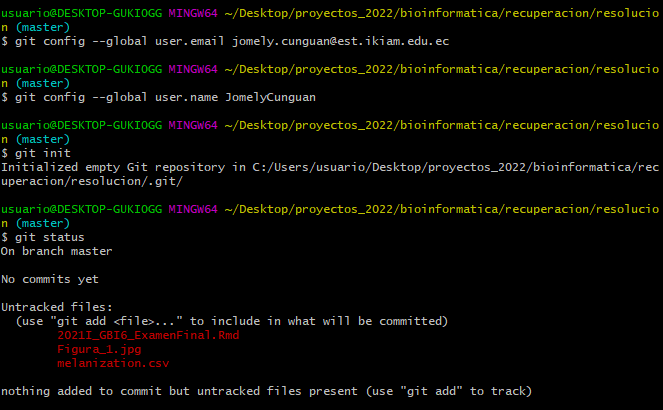
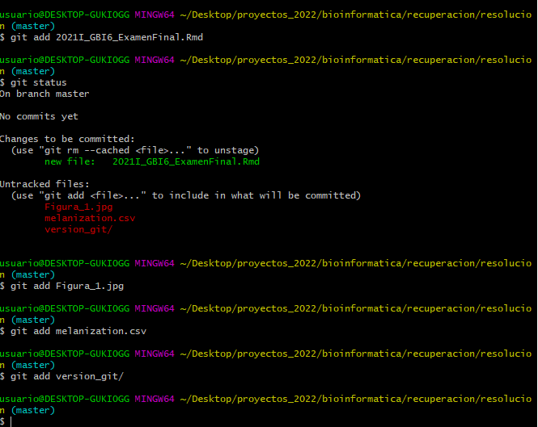

**Bienvenidos al examen final de GBI6 - Bioinformática. **

Esta permitido consultar todo material disponible: diapositivas, google...Sin embargo **NO** esta permitido consultar a sus colegas. 

Los contenidos de esta evaluación corresponden a los temas: 

* Tipos de datos

* Estructuras de control

* Funciones

* Manipulación de datos

* Estadística básica 

* Visualización de datos


Ustedes estan utilizando el R Markdown. Las instruciones son:

* Creen una carpeta en su computador donde guarden este cuaderno .Rmd y la data que van a utilizar. 

* Definan a esa carpeta como su directorio de trabajo. 

* Arriba, donde dice "author", deben llenar sus nombres.

* Los codigos deben ser escritos dentro de las cajas que inician y terminan con ``` o dentro de las cajas indicadas abajo de las preguntas.

* Al final del examen deben utilizar el comando "Knit" para generar un archivo .html

* Es recomendable crear una copia de este script guía. 

* Cargue el archivo .html en el aula virtual, donde dice "ExamenFinal". 

* Asegúrese de responder explícitamente cada una de las preguntas. 
Suerte!

## **1.1 [7 PUNTOS]**

Lea el artículo [Reitmayer, C.M. et al. 2021](https://doi.org/10.1038/s42003-021-02236-5). El estudio trata sobre el tipo de convergencia de las frecuencias de aleteo de mosquitos machos y hembras de los mosquitos vectores del Dengue. Asimismo, esta convergencia quieren anañizar si está asociado al procentaje de melanización  (No, partial, full) y los efectos de estas características en la sobreviviencia de la progenie resultante. 

La información asociada al estudio ha sido descargada y se encuentra en la carpeta **data** (si desea revisar los detalles de la data ingrese a [datadryad.org](https://datadryad.org/stash/dataset/doi:10.5061/dryad.ffbg79ct0)), asimismo lea el archimo ```Readme.docx````. 


En esta evaluación. su trabajo consiste es generar figura 1 (1a, 1b, 1c) tal como se muestra en el artículo. 

Realice el análisis paso a paso, comentando lo que hacen las líneas de cósigo. 

### Librerías


```{r librerias}
# cargue aquì las librerias, de ser necesario instale las que requiera

library(readr)
library(tidyr)
library(dplyr)
library(ggplot2)
library(ggpubr)
```

### Exploración
```{r exploracion}
getwd() ## observamos en el directorio donde nos encontramos. 

## ubicamos en el directorio que creamos la carpeta donde estara la data y el archivo .rmd 

setwd("C:/Users/usuario/Desktop/proyectos_2022/bioinformatica/recuperacion/resolucion/")

## cargamos la data melanization.csv 

melanization <- read_csv("melanization.csv")


## creamos tres df que filtran los datos de interes segun el gráfico

## En el primero seleccionamos y filtramos con los criterios parental.pair, melanization y sex
## posteriormente agregamos un pipe y utilizamos la función summarise para contar la frecuencia que se repite
## cada uno de los criterios ej: parental pair = 1, melanization = 1, sex = male 

datos_1 <- melanization %>% group_by(parental.pair, melanization, sex) %>% 
  summarise(count = n()) %>% 
  filter(parental.pair >=1, melanization >=0, sex == "male" | sex == "female")

## el el segundo df mediante la funcion filter se elegio el sexo male 

datos_2 <- melanization %>% group_by(parental.pair, convergence, melanization, sex) %>% 
  summarise(count = n()) %>% 
  filter(parental.pair >=1, convergence == "converged" | convergence == "nonconverged", 
         sex == "male")

## el el tercer df mediante la funcion filter se elegio el sexo female 

datos_3 <- melanization %>% group_by(parental.pair, convergence, melanization, sex) %>% 
  summarise(count = n()) %>% 
  filter(parental.pair >=1, convergence == "converged" | convergence == "nonconverged", 
         sex == "female")
## Modifico la variable melanization de 0, 1 y 2 a Not, Partial y Full en los tres df 

datos_1$melanization[datos_1$melanization == 0] <- "Not"
datos_1$melanization[datos_1$melanization == 1] <- "Partial"
datos_1$melanization[datos_1$melanization == 2] <- "Full"

datos_2$melanization[datos_2$melanization == 0] <- "Not"
datos_2$melanization[datos_2$melanization == 1] <- "Partial"
datos_2$melanization[datos_2$melanization == 2] <- "Full"

datos_3$melanization[datos_3$melanization == 0] <- "Not"
datos_3$melanization[datos_3$melanization == 1] <- "Partial"
datos_3$melanization[datos_3$melanization == 2] <- "Full"

## se creo tres vectores vacios, uno para cada df 

suma_1 <-vector()
suma_2 <-vector()
suma_3 <-vector()

## Creación de tres vectores que contiene el total de numero de individuos por cada parental.pair 44 

## Se lo realizo los tres df 

for (i in 1:44) {
  suma_1[length(suma_1) + 1] <- datos_1 %>% filter(parental.pair == i) %>% 
    pull(count) %>% sum
}

for (i in 1:44) {
  suma_2[length(suma_2) + 1] <- datos_2 %>% filter(parental.pair == i) %>% 
    pull(count) %>% sum
}

for (i in 1:44) {
  suma_3[length(suma_3) + 1] <- datos_3 %>% filter(parental.pair == i) %>% 
    pull(count) %>% sum
}

## se creo tres df vacios 

porciento_1 <- NULL

porciento_2 <- NULL

porciento_3 <- NULL

## se creo una nueva variable mediante la función mutate, esta variable es el porcentaje de frecuencia 
## en cada uno de los parental.pair. 

for (i in 1:44) {
  prueba_1 <- datos_1 %>%  filter(parental.pair == i) %>%
  mutate(porcentaje = count*100/suma_1[i]) ## crea una nueva columna y realiza operaciones entre ellas. 
  porciento_1 <- rbind(porciento_1, prueba_1) ## sirve para unir filas 
}

for (i in 1:44) {
  prueba_2 <- datos_2 %>%  filter(parental.pair == i) %>%
    mutate(porcentaje = count*100/suma_2[i])
  porciento_2 <- rbind(porciento_2, prueba_2)
}

for (i in 1:44) {
  prueba_3 <- datos_3 %>%  filter(parental.pair == i) %>%
    mutate(porcentaje = count*100/suma_3[i])
  porciento_3 <- rbind(porciento_3, prueba_3) 
}

## posteriormente se ordeno los datos mediante la función factor para que las etiquetas sex aparezca 
## primero la del hombre 

porciento_1$sex = factor(porciento_1$sex, levels = c("male", "female"))

## posteriormente se ordeno los datos mediante la función factor para que las etiquetas melanization 
## aparezca  en el orden segun la figura del articulo 


porciento_1$melanization = factor(porciento_1$melanization, levels = c("Not", "Partial", "Full"))

## se creo un plot y se guardo en una variable 

## funcion aes sirve para agregar los datos de "x" y de "y", col = para separar mediante el sex  
plot_1 <- ggplot(porciento_1, aes(x = melanization, y = porcentaje, col = sex )) +
  ## etiqueta labs sirve para agregar los titulos en el eje x y y 
  labs(x = "Degree of melanization", y = "Proportion of beads" ) + 
  ## theme_classic mantiene el fondo blanco, 
  ## lwd y fatter grosor de las lineas del boxplot y mediana respectivamente 
  theme_classic() + geom_boxplot(lwd = 1, fatten = 1) + 
  ## strip.background y strip.txt.x elimina las leyenda 
  theme(strip.background = element_blank(),
        strip.text.x = element_blank(),
        axis.title.x = element_text(face = "bold", size = 14), ## tamaño y negrita de la etiqueta del eje x
        axis.title.y = element_text(face = "bold", size = 14)) + ## tamaño y negrita de la etiqueta del eje y
  ## reagrupar los boxplots mediante el sexo y la funcion scale añadir los colores manualmente 
  facet_wrap(~sex) + scale_color_manual(values = c("darkgray", "red")) 

color = c("darkgray", "red")

## ajustamos el orden de la presentacion del eje x mediante la funcion factor

porciento_2$melanization = factor(porciento_2$melanization, 
                                  levels = c("Not", "Partial", "Full"))

plot_2 <- ggplot(porciento_2, aes(x = convergence, y = porcentaje, col = melanization)) +
  labs(x = "Harmonic convergence status", y = "Proportion of beads" ) +
  theme_classic() + 
  geom_boxplot(aes(linetype = melanization), lwd = 1, fatten = 1, color = "darkgray") +  
  theme(axis.title.x = element_text(face = "bold", size = 14), 
        axis.title.y = element_text(face = "bold", size = 14)) + 
  ## scale_linetype permite reprentar las lineas del boxplot de diferente forma. Por ejemplo, lineas 
  ## contiunas o discontinuas 
  scale_linetype_manual(values=c("twodash", "longdash", "solid"))

## ajustamos el orden de la presentacion del eje x mediante la funcion factor

porciento_3$melanization = factor(porciento_3$melanization, 
                                  levels = c("Not", "Partial", "Full"))

plot_3 <- ggplot(porciento_3, aes(x = convergence, y = porcentaje, col = melanization)) +
  labs(x = "Harmonic convergence status", y = "Proportion of beads" ) +
  theme_classic() + 
  geom_boxplot(aes(linetype = melanization), lwd = 1, fatten = 1, color = "red") +  
  theme(axis.title.x = element_text(face = "bold", size = 14), 
        axis.title.y = element_text(face = "bold", size = 14)) + 
  scale_linetype_manual(values=c("twodash", "longdash", "solid"))

## contar el porcentaje se realizo la siguiente linea como ejemplo 
## porciento_3 %>% filter(melanization == "Full" & sex == "female" & convergence == "nonconverged") %>% pull(count) %>% sum 

## resultados 
## Male, converged, n= 173, 51% Not; 30% Partial; 19% Fully 
## Male, not converged, n = 130, 40% Not; 29% Partial; 31% Fully 


## Female, converged, n = 280, 21% Not; 39% Partial; 40% Fully  
## Female, not converged, n = 221,  19% Not; 38% Partial ; 43% Fully 

```

### Gráfica 1a
```{r figura_1a}
plot_1


```


### Gráfica 1b
```{r figura_1b}
plot_2

```


### Gráfica 1c
```{r figura_1c}
plot_3


```


### Gráfica 1 
(los tres juntos, como se muestra en el artículo)
```{r figura_1}
ggarrange(plot_1, plot_2, plot_3, ncol = 1, nrow = 3, labels = c("a", "b", "c"), 
          common.legend = FALSE)


```


### Análisis del resultado en sus propias palabras. 

Escriba aquí su análisis 

En la figura 1 se mide la melanization humoral de machos y hembras. Se observa en la figura 1a que las hembras mostraron una respuesta de melanización mas fuerte que los machos. Luego del test de melanización de 24 h se pudo observar que el 50% presentaron una completa melanización 30% una melanización parcial y 25% no presentaron melanización. Por su parte en los machos cerca del 35% de los huevos no presentaron melanización y en el caso de los huevos parcial y completamente melanizados presentarion valores similares cercano a 20%. 
En la figura 1b se mostro que el estado de conververgancia armonica de los padres afecto la respuesta de la melanización. Sin embargo, fue mas evidente en el caso de la descendencia masculina. Se evidenciaron dos casos particulares que presentaron diferencias dependiendo de la convergencia de la progenie. Los machos provenientes de parejas parentales con estatus convergido con exito tenian menor probablidad de melanizar los huevos (51% sin melanizar) en relación con los machos de padres que no convergían (40% sin melanizar). El segundo caso fue que los machos provenientes de parejas con estatus no convergido tenian mayor probabilidad de melanizar los huevos (31%) en relación con los machos de padres que convergían (19%). 
Finalmente, en el caso de la descendencia femeninda, no se observo algun efecto significativo del estado de convergencia de los padres en respuesta de la melanización. 


Guarde la figura 1 como un archivo .jpg, con una reoslución de 300 dpi. 
```{r guardar_figura}
# escriba el código para guardar la figura 1
ggsave(filename = "Figura_1.jpg", width = 7 , height = 9, device='jpg', 
       dpi=300)

```


## **1.2 [3 PUNTOS]**

Utilice git para guardar la figura y su cuaderno .Rmd en GitHub. 

Inserte aquí la captura de pantalla de las instrucciones realizadas en el terminal (Git Bash)







Inserte aquí el enlace donde se encuentra la figura y el cuaderno .Rmd en GitHub. 

https://github.com/JomelyCunguan/GBI6_Examen_Recuperacion 

[enlace de la tarea](https://www.github.com)